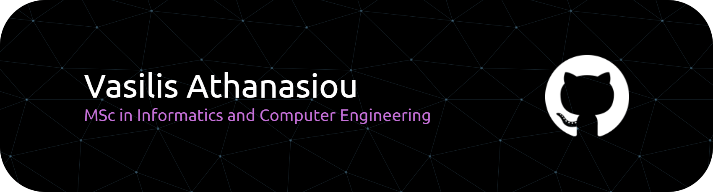

  

---

# 👨‍💻 About Me

**MSc graduate in Informatics and Computer Engineering** with a strong focus on backend development, cloud-native systems, and DevOps practices.

I specialize in building scalable backend services using **.NET** and designing **microservices architectures** deployed with **Docker** and **Kubernetes**. My diploma thesis focused on a **cloud-native smart traffic system**, implementing containerized microservices, **CI/CD pipelines**, and **event-driven communication**.

---

## 🔬 Research & Publications

- **Smart Traffic Lights System (STLS):**
  - Design and Implementation of Smart Traffic Lights System using Microservices and Container-based Virtualization _(Publication in Progress)_
  - **Thesis available**: https://polynoe.lib.uniwa.gr/xmlui/handle/11400/11153
- **Knowledge Management Systems (KMS):**
  - Current Trends and Challenges in Knowledge Management Systems: A Systematic Comparative Analysis _(Publication in Progress)_
  - **Paper available**: https://github.com/Knowledge-Management-aka-Uniwa/KMS.git

---

### 🎓 Education

- **MSc in Informatics and Computer Engineering**  
  _University of West Attica (UNIWA)_

- **English Language Proficiency**  
  _Michigan State University_

---

### 🛠️ Technical Focus

- **Architecture:** Microservices, Event-Driven Systems, REST APIs
- **Cloud & DevOps:** Docker, Kubernetes, CI/CD, Container Orchestration
- **Systems:** Concurrency, Networking, IPC (Sockets), Performance Optimization
- **Domains:** Smart Cities, IoT Systems, Distributed Infrastructure

---

## 🛠 Tech Stack

**Backend & Logic**    

**Cloud & DevOps**    

**Databases & Caching**    

**Core Engineering**   

---

## 🚀 Top Featured Academic Projects

### 🚥 [Diploma Thesis](https://polynoe.lib.uniwa.gr/xmlui/handle/11400/11153): Design and Implementation of Smart Traffic Lights System using Microservices and Container-based Virtualization

**Flow: Networking, Distributed Systems, Cloud & IoT**

- Architected a cloud-native, event-driven system using **.NET 9.0 microservices** and **RabbitMQ** for intelligent traffic management.
- Orchestrated the stack with **Docker** and **Kubernetes**, utilizing a hybrid data approach with **MSSQL**, **PostgreSQL**, **MongoDB**, and **Redis**.
- 🔗 **Repository:** [Ath21/Smart-Traffic-Lights-System](https://github.com/Ath21/Smart-Traffic-Lights-System)

---

### 📝 [Knowledge Management](https://github.com/Knowledge-Management-aka-Uniwa): Current Trends and Challenges in Knowledge Management Systems: A Systematic Comparative Analysis

**Flow: Research & Systematic Analysis**

- Conducted a **Systematic Comparative Analysis** of modern Knowledge Management Systems (KMS), identifying critical gaps in current distributed architectures.
- Evaluated the integration of **AI-driven retrieval** and **Cloud-native infrastructures** within organizational knowledge flows.
- Currently transforming this research into a formal academic publication to contribute to the field of Information Systems.
- 🔗 **Repository:** [Knowledge-Management/KMS](https://github.com/Knowledge-Management-aka-Uniwa/KMS.git)

---

### 🖥️ [Software Engineering](https://github.com/Preze-Cinemas-Desktop): Preze Cinemas Desktop (Full SDLC)

**Flow: Software Engineering, Design & HCI**

- Developed a comprehensive desktop ERP using **Java Swing/AWT**, managing the complete **Software Development Life Cycle (SDLC)**.
- **Phase 1-3:** Conducted Use Case Analysis, SRS documentation, and Robustness Diagram design.
- **Phase 4-5:** Implemented the full Source Code and executed User Acceptance Testing (UAT) to ensure functional reliability.
- 🔗 **1. Use Cases Repository:** [Preze-Cinemas-Desktop/Use-Cases](https://github.com/Preze-Cinemas-Desktop/Use-Cases)
- 🔗 **2. SRS Repository:** [Preze-Cinemas-Desktop/Requirements](https://github.com/Preze-Cinemas-Desktop/Requirements)
- 🔗 **3. Robustness Repository:** [Preze-Cinemas-Desktop/Robustness](https://github.com/Preze-Cinemas-Desktop/Robustness)
- 🔗 **4. Source Code Repository:** [Preze-Cinemas-Desktop/Code](https://github.com/Preze-Cinemas-Desktop/Code)
- 🔗 **5. UAT Repository:** [Preze-Cinemas-Desktop/User-Acceptance-Testing](https://github.com/Preze-Cinemas-Desktop/User-Acceptance-Testing)

---

### 🎬 [Special Topics in Software Engineering](https://github.com/Preze-Cinemas-Web): Preze Cinemas Web (Full-Stack Collaboration)

**Flow: Software Engineering, Design & HCI**

- Engineered a high-concurrency **RESTful API** using **.NET 6** for movie reservations, user management, and secure payments.
- **Team Collaboration:** Acted as the Backend lead, coordinating with a dedicated Frontend team to integrate a **React.js** interface with complex business logic.
- Implemented Monolithic Architecture principles to ensure system reliability and seamless API-to-UI data flow during peak booking loads.
- 🔗 **Backend Repository:** [Preze-Cinemas-Web/Back-end](https://github.com/Preze-Cinemas-Web/Back-end)
- 🔗 **Frontend Repository:** [Preze-Cinemas-Web/Front-end](https://github.com/Preze-Cinemas-Web/Front-end)

---

### ☁️ [Cloud Computing & Services](https://github.com/Cloud-Computing-and-Services): Virtual Lab - Dockerized Cloud Services

**Flow: Networking, Distributed Systems, Cloud & IoT**

- Built a containerized sandbox using **Docker Compose** to deploy and stress-test distributed services like WordPress and MySQL.
- Configured isolated virtual networks and persistent storage volumes to simulate production-grade cloud environments.
- 🔗 **Repository:** [Cloud-Computing-and-Services/Virtual-Lab](https://github.com/Cloud-Computing-and-Services/Virtual-Lab)

---

### 🎭 [Distributed Systems](https://github.com/Distributed-Systems-aka-Uniwa): Theater Reservation System with Java RMI

**Flow: Networking, Distributed Systems, Cloud & IoT**

- Implemented a **distributed application** using **Java RMI** for remote communication.
- Managed **concurrent client requests** and ensured consistency in booking operations.
- 🔗 Repository: [Distributed-Systems/RMI](https://github.com/Distributed-Systems-aka-Uniwa/RMI.git)

---

### 🔐 [Information Technology Security](https://github.com/Information-Technology-Security): Buffer Overflow

**Flow: Cyber Security**

- Analyzed and exploited **stack-based buffer overflow vulnerabilities** in C programs.
- Studied memory layout, stack frames, and execution flow manipulation techniques.
- Developed understanding of **low-level system vulnerabilities and defensive mechanisms**.
- 🔗 Repository: [Information-Technology-Security/Buffer-Overflow](https://github.com/Information-Technology-Security/Buffer-Overflow.git)

---

### ⚡ [Parallel Systems](https://github.com/Parallel-Systems-aka-Uniwa): Covariance Register

**Flow: Parallel & High-Performance Computing**

- Accelerated statistical matrix calculations by leveraging **GPGPU programming** with the **NVIDIA CUDA** framework.
- Optimized memory throughput and thread synchronization for high-performance mathematical processing.
- 🔗 **Repository:** [Parallel-Systems-aka-Uniwa/Covariance-Register](https://github.com/Parallel-Systems-aka-Uniwa/Covariance-Register)

---

## 🎓 Academic Roadmap (UNIWA)

📂 <b>01. Mathematics, Algorithms & Signal Processing</b>

- [Algorithms and Complexity](https://github.com/Gandalf-Saga)
  - Design and Analysis of Algorithms
  - Algorithms and Complexity
- [Signals and Systems](https://github.com/Signals-and-Systems-aka-Uniwa)
  - Learning of Matlab
  - Analog Signals
  - Constant Time Systems
  - Final Project
- [Digital Signal Processing](https://github.com/Digital-Signal-Processing-aka-Uniwa)
  - Digital Signal Processing at Matlab
- [Digital Communications](https://github.com/Digital-Communications-aka-Uniwa)
  - Digital Communications at Matlab
- [Physics](https://github.com/Physics-aka-Uniwa)
  - Errors

📂 <b>02. Hardware, Circuits & Electronics</b>

- [Circuit Theory](https://github.com/Circuit-Theory)
  - Kirchhoff's Laws - Ohm Law - Potentiometer - Rheostat
  - RLC Components, Transient Response
  - RLC Component Connections to AC Power Supply
  - Coordination
- [Electronics](https://github.com/Electronics-aka-Uniwa)
  - Resistance and Oscilloscope
  - Diode
  - RC Filters and Scissors
  - Rectification
  - Bipolar Junction Transistor (BJT)
- [Logic Design](https://github.com/Logic-Design-aka-Uniwa)
  - Logic Gates
  - Flip Flops
  - Adders Deductors
  - Registers Sliders
- [Microelectronics](https://github.com/Microelectronics-aka-Uniwa)
  - 4-bit AD/DA Converter using Operational Amplifiers
- [Digital Circuit Design](https://github.com/Digital-Circuit-Design)
  - Introduction to the simulation environment
  - Sequential Circuits
  - Register Files
  - Simple Circle of a MIPS Processor

📂 <b>03. Programming Fundamentals & Software Development</b>

- [Computer Programming](https://github.com/Computer-Programming-aka-Uniwa)
  - Introduction to C Programming
  - C Programming Fundamentals
  - Control Structures
  - Loops
  - Subprograms
  - Arrays, Pointers, Files
  - Minesweeper
- [Object-Oriented Programming](https://github.com/Object-Oriented-Programming-aka-Uniwa)
  - From C to C++
  - Introduction to C++ Classes
  - Inheritance
  - Babis Poteridis and the Magic Notebook Searching
  - Media Player
- [Data Structures](https://github.com/Data-Structures-aka-Uniwa)
  - Arrays
  - Stacks
  - List
- [Software Development Methodologies](https://github.com/Software-Development-Methodologies)
  - Classes and Inheritance
  - Java I/O
  - Java GUI
  - Event Handling

📂 <b>04. Systems, Operating Systems & Low-Level</b>

- [Operating Systems I](https://github.com/Operating-Systems-1)
  - Basic Linux Commands
  - Bash Scripts
- [Operating Systems II](https://github.com/Operating-Systems-2-aka-Uniwa)
  - Process Management with Fork and Wait in C
  - Parallel Inner Product Calculation using C POSIX Threads
  - POSIX Threads Synchronization - Semaphores, Condition Variables
  - UNIX-Domain Stream Sockets Communication for Fibonacci Sequence Validation
- [Compilers](https://github.com/Compilers-aka-Uniwa)
  - Design and Implementation of a Compiler at Uni-C

📂 <b>05. Networking, Distributed Systems, Cloud & IoT</b>

- [Diploma Thesis](https://polynoe.lib.uniwa.gr/xmlui/handle/11400/11153)
  - Design and Implementation of Smart Traffic Lights System using Microservices and Container-based Virtualization
- [Computer Networks II](https://github.com/Computer-Networks-2)
  - OSPF Routing
  - TCP
- [Network Programming](https://github.com/Network-Programming-aka-Uniwa)
  - Sockets
- [Distributed Systems](https://github.com/Distributed-Systems-aka-Uniwa)
  - Mathematical Equations using Remote Procedure Call (RPC)
  - Theater Reservation System with Java RMI
- [Cloud Computing and Services](https://github.com/Cloud-Computing-and-Services)
  - Use Cases at CloudSim
  - Virtual Lab - Dockerized Cloud Services
- [Internet of Things](https://github.com/Internet-of-Things-aka-Uniwa)
  - Traffic Light Sequence with Arduino UNO, ESP-01 and ThingSpeak

📂 <b>06. Parallel & High-Performance Computing</b>

- [Introduction to Parallel Computing](https://github.com/Introduction-to-Parallel-Computing)
  - Message Passing Interface (MPI)
  - Collective Communication
- [Parallel Systems](https://github.com/Parallel-Systems-aka-Uniwa)
  - Parallel Computing using OpenMP
  - Multisort
  - Parallel Computing using CUDA
  - Covariance Register

📂 <b>07. Software Engineering, Design & HCI</b>

- [Software Engineering](https://github.com/Preze-Cinemas-Desktop)
  - Preze Cinemas Desktop - Phase 1 Use Case Analysis
  - Preze Cinemas Desktop - Phase 2 Software Requirements Specification
  - Preze Cinemas Desktop - Phase 3 Robustness Diagram Design
  - Preze Cinemas Desktop - Phase 4 Source Code
  - Preze Cinemas Desktop - Phase 5 User Acceptance Testing
- [Special Topics in Software Engineering](https://github.com/Preze-Cinemas-Web)
  - Preze Cinemas Web Back-end
  - Preze Cinemas Web Front-end
- [Software Quality and Reliability](https://github.com/Software-Quality-and-Reliability)
  - Software Life Cycle Models and Methodologies
  - Software Development in C# and Reliability using Unit Tests
- [Analysis of Information Systems](https://github.com/Analysis-of-Information-Systems)
  - Cash Withdrawal Analysis and Design
  - Real Estate Marketing Analysis and Design
- [Design and Development of Information Systems](https://github.com/Development-of-Information-Systems)
  - Unified Information System for Health Units (Cash Management)
- [Human-Computer Interaction](https://github.com/Human-Computer-Interaction)
  - Virtual Gym
- [Computer Graphics](https://github.com/Computer-Graphics-aka-Uniwa)
  - 3D Graphics Scene Using WebGL

📂 <b>08. Databases & Data Science</b>

- [Databases I](https://github.com/Data-Bases-1)
  - Create and Manage a Database
  - Subqueries in SQL Language
  - Classification and Suggestions - GROUP BY, AND, HAVING, JOIN
- [Databases II](https://github.com/Data-Bases-2)
  - Creation of Database personnel
  - Constraints
  - Views
  - Trigger
  - Variables, Functions, Procedures
- [Big Data Management](https://github.com/Big-Data-Management-aka-Uniwa)
  - Analysis of Unemployment and Police Killings in US

📂 <b>09. Artificial Intelligence & E-Learning</b>

- [Artificial Intelligence](https://github.com/Artificial-Intelligence-aka-Uniwa)
  - Real Genetic Algorithm Application
  - Application of Search Algorithms to the Pacman Problem
- [Information Retrieval](https://github.com/Information-Retrieval-aka-Uniwa)
  - Search Engine for Academic Papers
- [E-Learning](https://github.com/E-Learning-aka-Uniwa)
  - Artificial Intelligence at Education - Report
  - Artificial Intelligence at Education - Ollama

📂 <b>10. Cyber Security</b>

- [Information Technology Security](https://github.com/Information-Technology-Security)
  - Buffer Overflow
  - Cryptography
  - SQL Injection
  - Android Repackaging
  - TLS Scanning
- [Programming of Mobile Devices](https://github.com/Programming-of-Mobile-Devices)
  - Password Manager on Java Android

📂 <b>11. Research & Systematic Analysis</b>

- [Technical Writing](https://github.com/Technical-Writing-aka-Uniwa)
  - Technical Documentation Standards
  - Course Template
  - Equations at MS Word and Drawings at MS Visio
- [Knowledge Management](https://github.com/Knowledge-Management-aka-Uniwa)
  - Current Trends and Challenges in Knowledge Management Systems: A Systematic Comparative Analysis

## 📊 GitHub Stats

  

---

## 📬 Contact & Connect

- **LinkedIn:** [vasilis-athanasiou-7036b53a4](https://www.linkedin.com/in/vasilis-athanasiou-7036b53a4/)
- **Email:** [vathanasiou1908@gmail.com](mailto:vathanasiou1908@gmail.com)
- **Location:** Athens, Greece 🇬🇷
