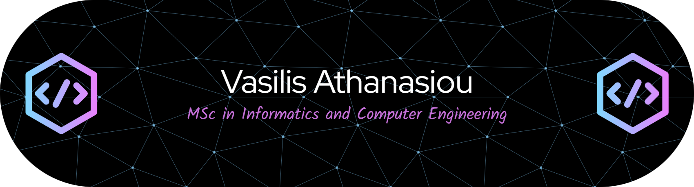
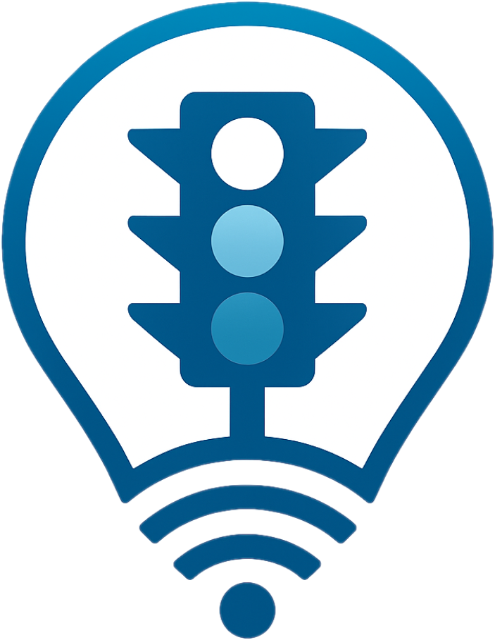
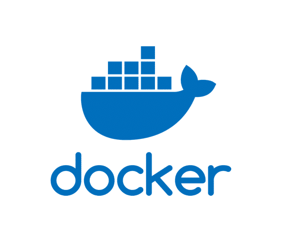
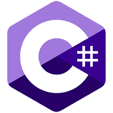

  

---

## About Me

I focus on designing and building scalable backend systems and cloud-native applications using modern engineering practices.

My interests include backend development, microservices architectures, containerization, and cloud infrastructure, with an emphasis on automation and system reliability.

---

## Tech Stack

**Backend**

- .NET (C#), REST APIs

**Cloud & DevOps**

- Docker, Kubernetes (Minikube)
- CI/CD (Bash, automation scripts)

**Databases**

- MSSQL, PostgreSQL, MongoDB, Redis

**Other**

- Linux, Git, Networking (TCP/IP, DNS)

---

## Featured Projects

  

### Smart Traffic Lights System

Cloud-native system for traffic management using scalable microservices and container orchestration.

- Built backend microservices using .NET (C#) and REST APIs
- Designed event-driven architecture with RabbitMQ
- Containerized services using Docker and deployed on Kubernetes (Minikube)
- Implemented CI/CD pipelines for automated build and deployment
- Used SQL & NoSQL databases (PostgreSQL, MongoDB, Redis)

Repository:  
https://github.com/Ath21/Smart-Traffic-Lights-System

Thesis:  
https://polynoe.lib.uniwa.gr/xmlui/handle/11400/11153

---

  

### Cloud Virtual Lab

Containerized environment for deploying and testing distributed services.

- Multi-container architecture using Docker Compose
- Service communication and internal networking
- Configurable environments for deployment scenarios

Repository:  
https://github.com/Cloud-Computing-and-Services/Virtual-Lab

---

  

### Cinema Booking Backend

Backend system for managing cinema bookings and operations.

- REST API built with .NET
- Database integration and persistence
- Client-server architecture

Repository:  
https://github.com/Preze-Cinemas-Web/Back-end

---

  

## Academic Projects

Projects are organized by flow/domain:

---

### Software & Information Systems

**Organizations**

- [Analysis-of-Information-Systems](https://github.com/Analysis-of-Information-Systems)
- [Development-of-Information-Systems](https://github.com/Development-of-Information-Systems)
- [Preze-Cinemas-Web](https://github.com/Preze-Cinemas-Web)
- [Preze-Cinemas-Desktop](https://github.com/Preze-Cinemas-Desktop)
- [Artificial-Intelligence-aka-Uniwa](https://github.com/Artificial-Intelligence-aka-Uniwa)
- [Big-Data-Management-aka-Uniwa](https://github.com/Big-Data-Management-aka-Uniwa)
- [Software-Development-Methodologies](https://github.com/Software-Development-Methodologies)
- [Software-Quality-and-Reliability](https://github.com/Software-Quality-and-Reliability)
- [Technical-Writing-aka-Uniwa](https://github.com/Technical-Writing-aka-Uniwa)
- [Object-Oriented-Programming-aka-Uniwa](https://github.com/Object-Oriented-Programming-aka-Uniwa)
- [Human-Computer-Interaction](https://github.com/Human-Computer-Interaction)
- [Information-Retrieval-aka-Uniwa](https://github.com/Information-Retrieval-aka-Uniwa)
- [Knowledge-Management-aka-Uniwa](https://github.com/Knowledge-Management-aka-Uniwa)
- [E-Learning-aka-Uniwa](https://github.com/E-Learning-aka-Uniwa)

**Projects**

- Bank Transaction System
- Real Estate Management System
- Cash Management System
- Cinema Booking System (Backend & Frontend)
- Genetic Algorithms
- Search Algorithms
- US Police Killings Data Analysis
- HRLib & Software Methods
- Java GUI Applications
- Maze Game, Media Player, Class & Inheritance
- Virtual Gym, Search Engine, KMS
- AI-at-Education, Ollama

---

### Networking & Distributed Systems

**Organizations**

- [Cloud-Computing-and-Services](https://github.com/Cloud-Computing-and-Services)
- [Computer-Networks-2](https://github.com/Computer-Networks-2)
- [Distributed-Systems-aka-Uniwa](https://github.com/Distributed-Systems-aka-Uniwa)
- [Network-Programming-aka-Uniwa](https://github.com/Network-Programming-aka-Uniwa)
- [Information-Technology-Security](https://github.com/Information-Technology-Security)

**Projects**

- Virtual Lab
- CloudSim
- OSPF & TCP Communication
- RMI & RPC Systems
- Socket Programming
- SQL Injection & TLS Scanning
- Buffer Overflow Exploitation

---

### Systems & Low-Level Computing

**Organizations**

- [Operating-Systems-1](https://github.com/Operating-Systems-1)
- [Operating-Systems-2-aka-Uniwa](https://github.com/Operating-Systems-2-aka-Uniwa)
- [Signals-and-Systems-aka-Uniwa](https://github.com/Signals-and-Systems-aka-Uniwa)
- [Digital-Signal-Processing-aka-Uniwa](https://github.com/Digital-Signal-Processing-aka-Uniwa)
- [Circuit-Theory](https://github.com/Circuit-Theory)
- [Digital-Circuit-Design](https://github.com/Digital-Circuit-Design)
- [Electronics-aka-Uniwa](https://github.com/Electronics-aka-Uniwa)
- [Parallel-Systems-aka-Uniwa](https://github.com/Parallel-Systems-aka-Uniwa)
- [Introduction-to-Parallel-Computing](https://github.com/Introduction-to-Parallel-Computing)
- [Physics-aka-Uniwa](https://github.com/Physics-aka-Uniwa)

**Projects**

- Bash Scripting & Linux Commands
- Fork, Threads & Synchronization
- Signal Processing (MATLAB)
- MIPS Architecture & VHDL
- RLC Circuits (AC/DC)
- CUDA & OpenMP Parallel Programming
- Multithreaded Systems

---

### Programming & Core Computer Science

**Organizations**

- [Computer-Programming-aka-Uniwa](https://github.com/Computer-Programming-aka-Uniwa)
- [Computer-Graphics-aka-Uniwa](https://github.com/Computer-Graphics-aka-Uniwa)
- [Data-Structures-aka-Uniwa](https://github.com/Data-Structures-aka-Uniwa)
- [Compilers-aka-Uniwa](https://github.com/Compilers-aka-Uniwa)
- [Gandalf-Saga](https://github.com/Gandalf-Saga)

**Projects**

- Minesweeper Game, Basic Programming Exercises
- Maze Game, Media Player
- Table-Chair, WebGL Examples
- Compiler Uni-C
- Arrays, Lists, Stacks
- Algorithm Design & Complexity Analysis

---

### Databases & Data Management

**Organizations**

- [Data-Bases-1](https://github.com/Data-Bases-1)
- [Data-Bases-2](https://github.com/Data-Bases-2)

**Projects**

- Create Database, SQL Queries, Join
- Constraints, Trigger, Functions/Procedures, Views

---

### Logic & Electronics

**Organizations**

- [Logic-Design-aka-Uniwa](https://github.com/Logic-Design-aka-Uniwa)
- [Microelectronics-aka-Uniwa](https://github.com/Microelectronics-aka-Uniwa)

**Projects**

- Adders & Deductors, Flip-Flops, Logic Gates, Register Slides
- 4-bit Converter

---

### Signals & Communications

**Organizations**

- [Digital-Communications-aka-Uniwa](https://github.com/Digital-Communications-aka-Uniwa)
- [Digital-Signal-Processing-aka-Uniwa](https://github.com/Digital-Signal-Processing-aka-Uniwa)
- [Signals-and-Systems-aka-Uniwa](https://github.com/Signals-and-Systems-aka-Uniwa)

**Projects**

- MATLAB projects, Analog Signals, Constant-Time Systems, Final

---

### Mobile & IoT

**Organizations**

- [Programming-of-Mobile-Devices](https://github.com/Programming-of-Mobile-Devices)
- [Internet-of-Things-aka-Uniwa](https://github.com/Internet-of-Things-aka-Uniwa)

**Projects**

- Password Manager
- Traffic Lights IoT

---

  

## Contact

LinkedIn:

https://www.linkedin.com/in/vasilis-athanasiou-7036b53a4/

Email:

vathanasiou1908@gmail.com
